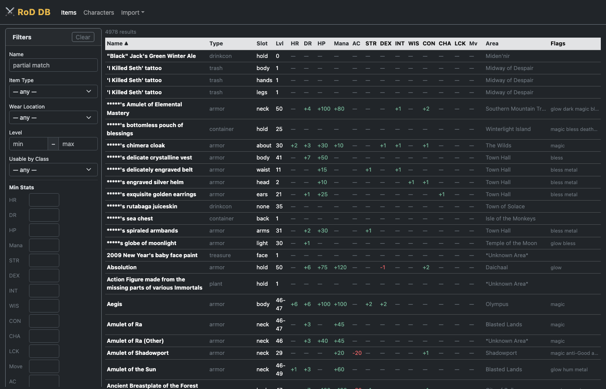
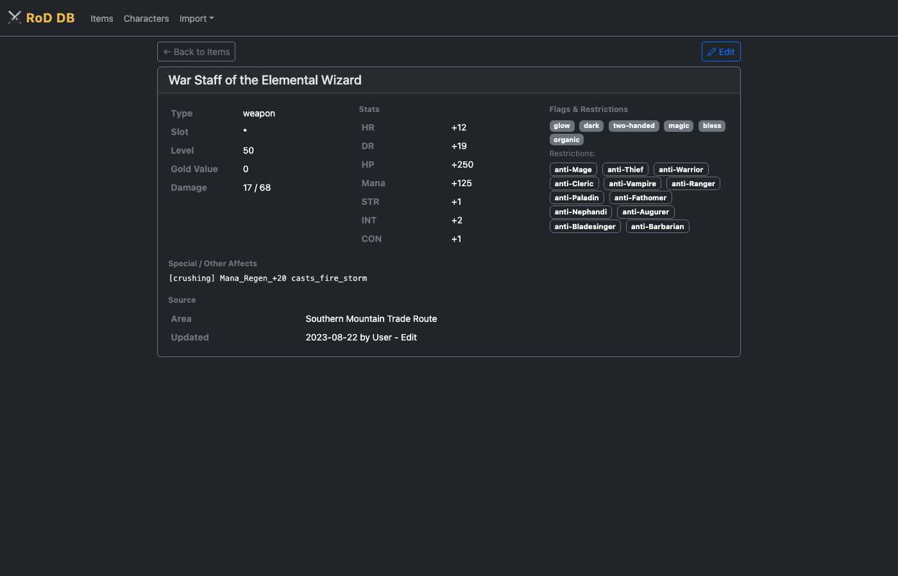

# ⚔ RoD Equipment Database

A locally-hosted web application for tracking, searching, and planning equipment in the MUD game **Realms of Despair**. Built to replace the legacy spreadsheet-based tools that are no longer maintained.

---

## Features

### Item Database
- Full searchable, filterable item database (5000+ items supported)
- Filter by item type, wear location, level range, class restrictions, stat minimums, area, mob source, and more
- Sortable columns — click any header to sort
- OOG (Out of Game), PK-only, and Gloried item flags with visual indicators
- Item detail pages showing all stats, flags, restrictions, and source info

### Importing Items
- **Bulk import** from pipe-delimited `RoD_Item.txt` files (the standard community database format)
- **Paste import** — paste the output of the in-game `identify` command directly into the browser; the parser auto-fills all fields it can read and presents a review form for anything it can't (class restrictions, mob source, area, gloried status)

### Character Profiles
- Create and manage multiple character profiles with base stats (STR/DEX/INT/WIS/CON/CHA/LCK, HP/Mana/Move)
- Assign items to each of the 21 wear slots in the correct in-game equipment order
- **Current Gear** and **Wanted Gear** side-by-side — plan your ideal loadout without overwriting what you have equipped
- Live stat totals — base + gear displayed for every stat; wanted totals shown alongside if they differ
- **Leveling Spells** toggle — adds +2 to all primary stats with one click for quick planning
- Copy current gear to wanted list in one click
- Duplicate characters for alt planning
- Gloried items highlighted in green with a ✦ icon in the equipment view

### Quality-of-Life
- Layerable slots (Body ×10, About ×10) and dual slots (Finger, Neck, Wrist, Wield, Ankle) automatically collapse empty entries — only filled slots and one open slot are shown; the rest tuck away behind a toggle
- Item search modal in the equipment screen — type to search by name, filtered to the correct wear location
- Dark theme throughout (Bootstrap 5)
- Pixel-art sword favicon

---

## Screenshots

**Item Database** — searchable, filterable table with sortable columns and a stat-filter sidebar


**Item Detail** — full stats, flags, class restrictions, special affects, and source info


---

## Tech Stack

| Layer | Technology |
|---|---|
| Backend | Python 3 · Flask |
| Database | SQLite (single `rod.db` file) |
| Frontend | Bootstrap 5.3 dark theme · Bootstrap Icons · Vanilla JS |
| Templating | Jinja2 |

No external services, no accounts, no internet connection required after setup. Everything runs locally.

---

## Setup

```bash
# Clone the repo
git clone https://github.com/dstrkto/rod-equipment-db.git
cd rod-equipment-db

# Install dependencies
pip3 install flask

# Start the server
python3 app.py
```

Then open **http://127.0.0.1:5001** in your browser.

To make it accessible to other machines on your LAN, the server already binds to `0.0.0.0` — just use your machine's local IP address.

### Importing your item data

Go to **Import → From File (.txt)** and point it at your `RoD_Item.txt` file. The parser handles the standard pipe-delimited v5.0 community format.

---

## Project Notes

The `rod.db` database file is excluded from this repository (see `.gitignore`) — it contains your local item data and character profiles and lives only on your machine.

---

## Credits

> This project was designed and built entirely by **[Claude](https://claude.ai)**, Anthropic's AI assistant, through a series of conversations with the project owner. Every line of Python, SQL, HTML, CSS, JavaScript, and even the pixel-art favicon was written by Claude — from the initial architecture through every feature addition and bug fix.

The human's role was to describe what they wanted, give feedback, and test the result. Claude handled the rest.

---

*Realms of Despair is a SMAUG-based MUD. This project is an unofficial fan tool and is not affiliated with the game or its administrators.*
